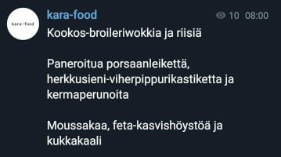

# 🥒 kara-food 🥖

## The official channel

You'll probably want to join the [official channel](https://t.me/kara_food) for daily updates at 08:00.



## Getting started with your own channel

All you need to do is to create two files in your home directory. `bot-token`, which contains your own bot's token, and `bot-target`, which contains the id of the user/group/channel you wish to send the messages to (e.g. `@alice`, `123someid` or `@somechannel`).

```
touch ~/bot-token
touch ~/bot-target
```

The program is divided in two parts based on functionality. The script called `bot-say` sends messages using Telegram's bot API, and `kara-food` acquires today's food menu from Sodexo's web site, and then sends it using `bot-say`.

Adding the scripts to your `$PATH` can prove useful if you wish to send messages through your bot at any time using `bot-say "<some message>"`.

## Dependencies

In order to run these scripts you need to have the following programs installed on your computer:

- `curl`
- `jq`

## Maintainership

As [@stefanrua](https://github.com/stefanrua) is leaving Nokia, we proudly announce [@suruaku](https://github.com/suruaku) as the new maintainer of this project :'). My boy.
